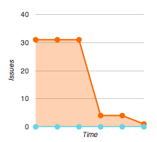

# PHP-DI 4.0 released

*Posted by [Matthieu Napoli](http://mnapoli.fr) on February 1st 2014*

I am extremely happy to announce that, after 4 months of work and more than 150 commits, PHP-DI version 4.0 has been released!

This is a new major release, and it delivers. As indicated by "major release", it comes with BC breaks, but this is for the better.

*PHP-DI 3.x users: BC-breaks are detailed in the [change log](../change-log.md), read the [migration guide from 3.x to 4.0](../doc/migration/4.0.md).*


## What's new?


### Completely new definition format

PHP-DI 3.x offered several definition formats, such as:

- autowiring (use of reflection)
- annotations
- YAML
- PHP array
- various undocumented, unstable formats (XML, JSON)…

PHP-DI 4.0 now offers:

- autowiring (unchanged)
- annotations (very few changes)
- PHP definitions

The last one is completely new, and is the result of several months of brainstorming and trials.
It is meant to be much more powerful and simpler to write and understand.

You can read more about [why the definition format has changed](06-php-di-4-0-new-definitions.md).


### Container methods

The container now offers new methods in addition to `get($id)`:

- `has($id)` will return `true` or `false` depending on if the container can provide the entry.

This method is also useful to make PHP-DI comply with future standards, and to improve container interoperability
(most containers have this method).

- `make($id, $params = [])` will **create** a new instance of the service using the given parameters.

Missing parameters are provided by the container. This is essentially the same as `get()`, except it ignores
the singleton scope.

This method makes the container work like a factory, so a new `FactoryInterface` has been introduced so that
you can type-hint against the interface and not couple yourself to the container.


### Framework integration

PHP-DI now works with Symfony 2 and Zend Framework 1 & 2!

It is actually pretty easy making PHP-DI work with any other framework, feel free to start a discussion
about your favorite framework on GitHub.


### Container interoperability

PHP-DI 4 has been thought so that it could work hand in hand with **other** containers.
For example, in the Symfony 2 integration, PHP-DI works perfectly along Symfony's native container.

PHP-DI also participates in the [Container Interop](https://github.com/container-interop/container-interop) initiative.
This group aims to provide interfaces that will help making different containers and frameworks work together.


### Code quality

This new major version also comes with even more code quality.

- Better architecture

A large part of the internals of PHP-DI has been rewritten for this new version. The core is now much more maintainable,
testable and extensible. Adding new features should be easier, and many edge cases that couldn't supported in 3.* are now fixed.

- Code coverage

Functional tests have been removed from the code coverage reports, so that only unit tests are taken into account.
Furthermore, every unit test uses the [`@covers` annotation](http://phpunit.de/manual/3.7/en/appendixes.annotations.html#appendixes.annotations.covers) from PHPUnit.

This allows to have a much more realistic and useful code coverage report. To give you an idea, the code coverage
**dropped from 91% to 60%**! A lot of work has been put into testing, and now the code coverage is back up to more than 85%.

- Scrutinizer-CI

The overall Scrutinizer-CI index went from **7.9** to **9.0**! Most issues have been fixed:




### Many small improvements

PHP-DI 4 comes with many small improvements too, and rather than list them all, you can see them in the [change log](../change-log.md).


## Installing PHP-DI 4.0

Just require `"mnapoli/php-di"` and [get started](../doc/getting-started.md).

Already using PHP-DI 3? Then edit your composer configuration:

```json
{
    "require": {
        "mnapoli/php-di": "~4.0"
    }
}
```

and run `composer update`.

You can also read the [migration guide from 3.x to 4.0](../doc/migration/4.0.md).


## Change log

You can also read the complete [change log](../change-log.md).
